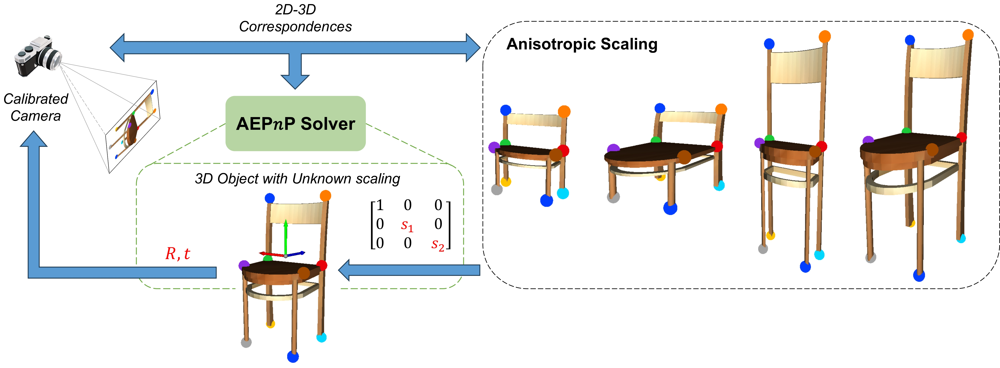
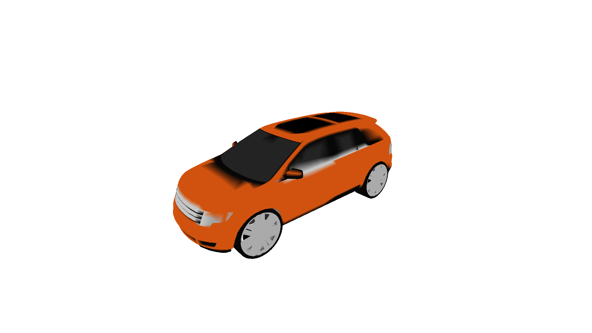
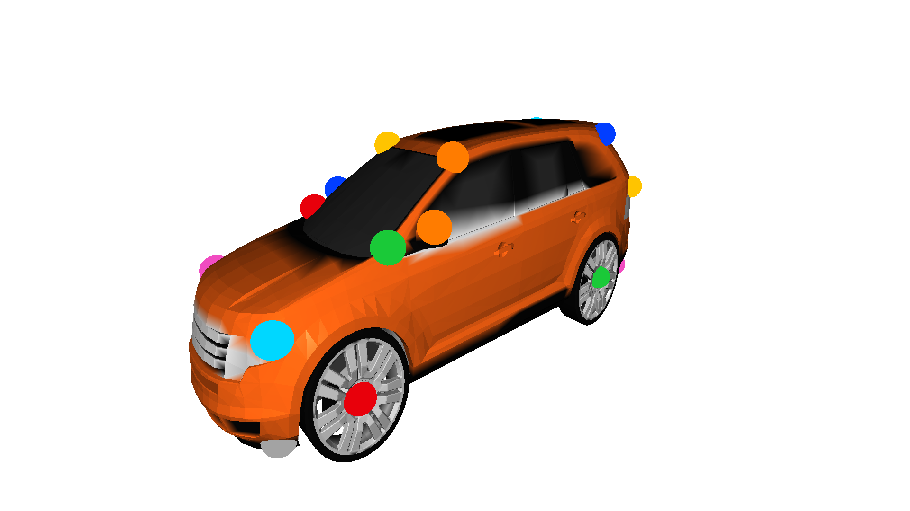

# AEPnP

This repository contains code and resources related to the paper [AEPnP: A Less-constrained EPnP Solver for Pose Estimation with Anisotropic Scaling](https://arxiv.org/abs/2310.09982) by Jiaxin Wei, Stefan Leutenegger, and Laurent Kneip.




## Abstract

> Perspective-n-Point (PnP) stands as a fundamental algorithm for pose estimation in various applications. In this paper, we present a new approach to the PnP problem with relaxed constraints, eliminating the need for precise 3D coordinates, which is especially suitable for object pose estimation where corresponding object models may not be available in practice. Built upon the classical EPnP solver, we refer to it as AEPnP due to its ability to handle unknown anisotropic scaling factors in addition to the common 6D transformation. Through a few algebraic manipulations and a well-chosen frame of reference, this new problem can be boiled down to a simple linear null-space problem followed by point registration-based identification of a similarity transformation. Experimental results on both simulated and real datasets demonstrate the effectiveness of AEPnP as a flexible and practical solution to object pose estimation.


## Installation

Install necessary dependencies and build the AEPnP solver
```
pip install -r requirements.txt
cd solver
pip install .
```

## Run Demo
First, please download the [Keypoint dataset](https://drive.google.com/drive/folders/1_d1TzZEF25Wy5kRj5ZugrgGeyf7xxu8F?usp=sharing) from [KeypointNet](https://github.com/qq456cvb/KeypointNet) repo and put it in the `keypoint` directory.

Then, you can run the demo using
```
python demo.py --test_cls <cls_name>
```
Please replace `<cls_name>` with the names of different categories (e.g. airplane, bathtub, bed, bottle, cap, car, chair, guitar, helmet, knife, laptop, motorcycle, mug, skateboard, table, vessel). 

It displays an original 3D model, and you can select a specific viewpoint by dragging within the window.

Press `q` to save the current viewpoint. Here shows an example image.



Following that, it randomly stretches the 3D model along the y and z axes and highlights its keypoints.



Finally, our AEPnP solver is applied to estimate both rigid transformation and anisotropic scaling factors.


The ground truth and predictions are denoted by green and red bounding boxes, respectively. The length of the axis also indicates the anisotropic scaling applied along that dimension.

> Please note that in this demo, we are using sparse keypoints for pose estimation. Our AEPnP solver can achieve better performance when provided with more 2D-3D correspondences. Also, we add 1-pixel Gaussian noise to 2D image coordinates to manifest the effectiveness of AEPnP.


## Citation

If you find our work useful in your research, please cite our paper:

```
@misc{wei2024aepnp,
      title={AEP$n$P: A Less-constrained EPnP Solver for Pose Estimation with Anisotropic Scaling}, 
      author={Jiaxin Wei and Stefan Leutenegger and Laurent Kneip},
      year={2024},
      eprint={2310.09982},
      archivePrefix={arXiv},
      primaryClass={cs.CV}
}
```

If you have any questions, please feel free to contact Jiaxin Wei (jiaxin.wei@tum.de).

