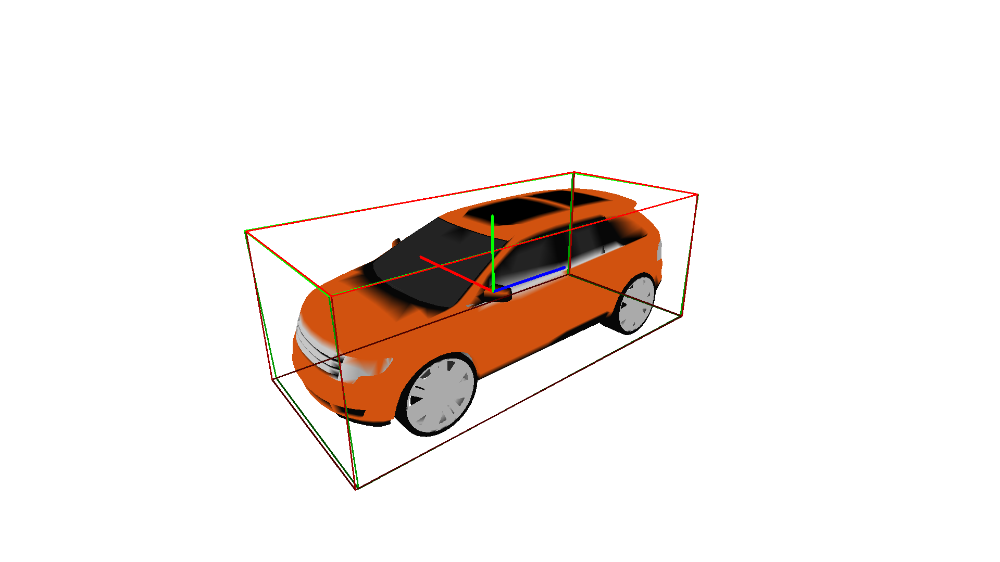

# APnP

This repository contains code and resources related to the paper [APnP: A Less-constrained PnP Solver for Pose Estimation with Unknown Anisotropic Scaling or Focal Lengths](https://arxiv.org/abs/2310.09982) by Jiaxin Wei, Stefan Leutenegger, and Laurent Kneip.


## Abstract

> Perspective-n-Point (PnP) stands as a fundamental algorithm for pose estimation in various applications. In this paper, we present a new approach to the PnP problem with relaxed constraints, eliminating the need for precise 3D coordinates or complete calibration data. We refer to it as APnP due to its ability to handle unknown anisotropic scaling factors of 3D coordinates or alternatively two distinct focal lengths in addition to the conventional rigid pose. Through algebraic manipulations and a novel parametrization, both cases are brought into similar forms that distinguish themselves primarily by the order of a rotation and an anisotropic scaling operation. APnP furthermore brings down both cases to an identical polynomial problem, which is solved using the Gröbner basis approach. Experimental results on both simulated and real datasets demonstrate the effectiveness of APnP, providing a more flexible and practical solution to several pose estimation tasks.


## Installation

Install necessary dependencies and build the APnP solver
```
pip install -r requirements.txt
cd solver
python setup.py install
```

## Run Demo
First, please download the [Keypoint dataset](https://drive.google.com/drive/folders/1_d1TzZEF25Wy5kRj5ZugrgGeyf7xxu8F?usp=sharing) from [KeypointNet](https://github.com/qq456cvb/KeypointNet) repo and put it in the `keypoint` directory.

Then, you can run the demo using
```
python demo.py --test_cls <cls_name>
```
Please replace `<cls_name>` with the names of different categories (e.g. airplane, bathtub, bed, bottle, cap, car, chair, guitar, helmet, knife, laptop, motorcycle, mug, skateboard, table, vessel). 

It displays an original 3D model, and you can select a specific viewpoint by dragging within the window.

Press `q` to save the current viewpoint. Here shows an example image.


Following that, it randomly stretches the 3D model along the y and z axes and highlights its keypoints.


Finally, our RANSAC APnP solver is applied to estimate both rigid transformation and anisotropic scaling factors.



The ground truth and predictions are denoted by green and red bounding boxes, respectively. The length of the axis also indicates the anisotropic scaling applied along that dimension.

> Please note that in this demo, we are using sparse keypoints for pose estimation. Our APnP solver can achieve better performance when provided with more 2D-3D correspondences.


## Citation

If you find our work useful in your research, please cite our paper:

```
@misc{wei2023apnp,
      title={AP$n$P: A Less-constrained P$n$P Solver for Pose Estimation with Unknown Anisotropic Scaling or Focal Lengths}, 
      author={Jiaxin Wei and Stefan Leutenegger and Laurent Kneip},
      year={2023},
      eprint={2310.09982},
      archivePrefix={arXiv},
      primaryClass={cs.CV}
}
```

If you have any questions, please feel free to contact Jiaxin Wei (jiaxin.wei@tum.de).

